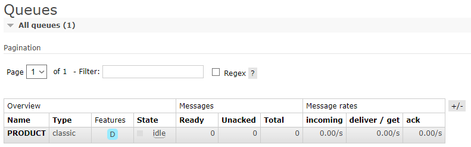

<h1 align="center">
    
</h1>

<h1 align="center">
    
</h1>

# Índice

- [Sobre](#-sobre)
- [Tecnologias utilizadas](#-tecnologias-utilizadas)

## 🔖 Sobre

Esta biblioteca possui como objetivo ser um centralizador de modelos utilizados pela fila `PRODUCT` do RabbitMQ, sendo atualmente utilizada pelos projetos:

- [Producer](https://github.com/leosantana9140/producer)
- [Consumer](https://github.com/leosantana9140/consumer)

---

## 💻 Tecnologias utilizadas

Esta biblioteca foi desenvolvida utilizando a seguinte tecnologia:

- [Java](https://dev.java)

---

<h3 align="center">
  Feito com ❤️ por Leonardo Santana
</h3>
